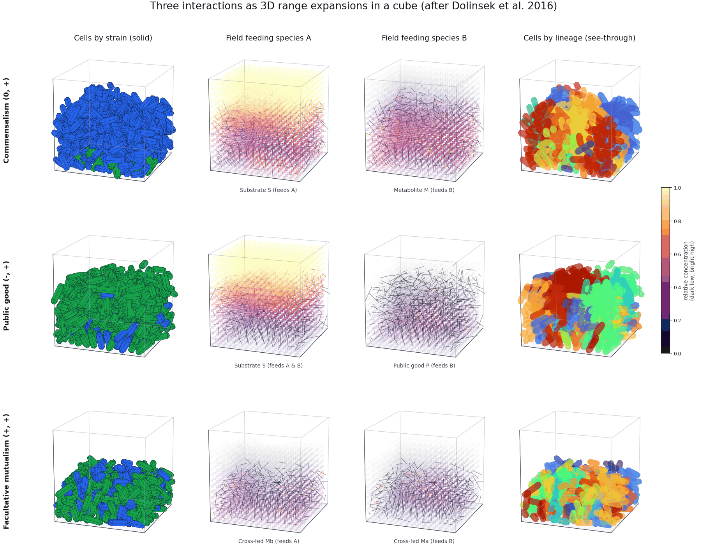
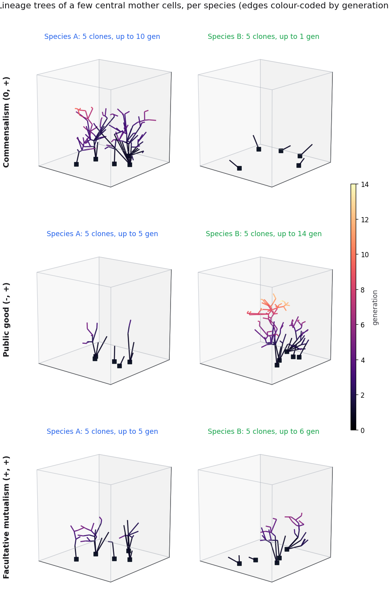
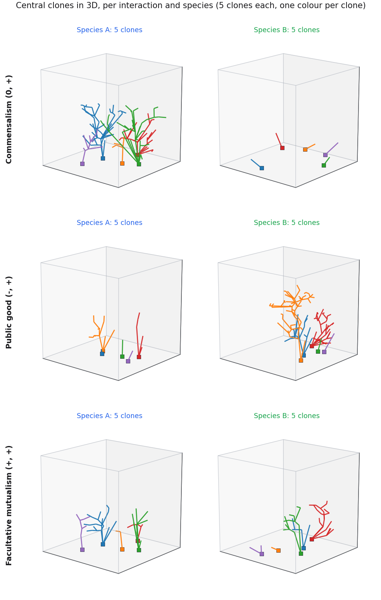
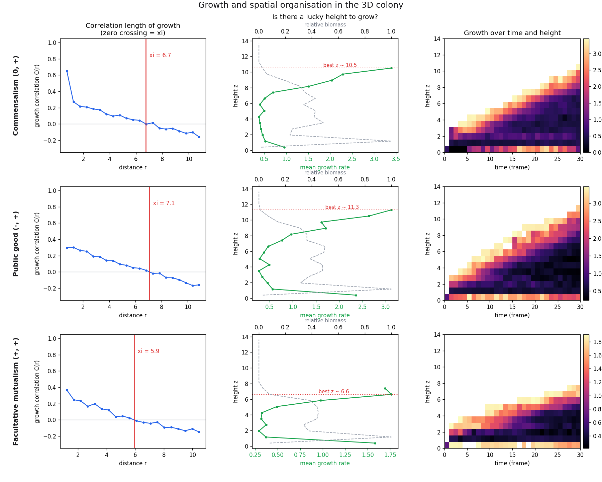

# Microbial interaction archetypes in a range-expanding rod colony: 3D cross section

A small, self-contained teaching model that grows a three-dimensional colony of rod-shaped cells (spherocylinders) inside a cube and shows how the canonical pairwise microbial interaction archetypes of Dolinsek, Goldschmidt and Johnson (2016) play out as a spatial range expansion. Two strains, A and B, are seeded as a flat patch of founders on the floor and grow upward and outward while exchanging or competing for diffusible chemicals. The colony is rendered as a rotating cube, and its genealogy and growth are analysed in space and time. It uses only NumPy, SciPy, Matplotlib and Pillow, so there is nothing exotic to install.



## The three interactions

Each interaction sets how the two strains read and write the shared chemical fields. The sign pair is the effect of each partner on the other, in the review's notation.

| Interaction | Signs | Mechanism in the model |
| --- | --- | --- |
| Commensalism | (0, +) | A grows on the external substrate and excretes a metabolite; B lives only on that metabolite. A is unaffected by B. |
| Public good | (-, +) | Both grow on the substrate, but A pays a cost to secrete a diffusible public good that accelerates B. B free-rides, paying nothing. |
| Facultative mutualism | (+, +) | Each strain secretes a metabolite the other uses, so both grow faster together, yet each can still grow alone at a reduced floor rate. |

These three span the axes the review emphasises: one-way versus two-way benefit, and passive (a by-product is simply there) versus active (a partner pays a metabolic cost to produce it).

## Install

```bash
python -m venv .venv && source .venv/bin/activate
pip install numpy scipy matplotlib pillow
```

## Run

```bash
python scripts/make_cube3d.py            # the four-view multipanel GIF
python scripts/make_cube3d_analysis.py   # lineage trees, clone cubes, growth analysis
```

Each script writes its figures into `figures/`. The animations are GIFs; static stills of the same figures are shown in this README.

## The 3D model in detail

Every symbol below is tunable in `config3d.py`.

**Diffusing fields.** Each chemical field $c(\mathbf{x},t)$ lives on a regular $N^3$ grid (default $N=32$ over a cube of side $L=14$, so $\Delta x = L/N$) and obeys a reaction-diffusion law,

$$\frac{\partial c}{\partial t} = D\,\nabla^2 c \;-\; \lambda\,c \;+\; \sum_i \sigma_i\,\delta(\mathbf{x}-\mathbf{x}_i),$$

with the Laplacian taken by six-point finite differences and integrated with explicit Euler, sub-stepped so that $D\,\Delta t_\text{sub}/\Delta x^2 < 1/8$ for stability. Two boundary conditions matter ecologically. The substrate $S$ uses a one-sided reservoir: $S=S_0$ on the top face only, with no-flux ($\partial c/\partial n=0$) on the four sides and the floor. Nutrient therefore enters from the medium above and must diffuse down through the colony, which is what produces a real top-to-bottom gradient instead of a uniform bath. Secreted molecules (the metabolite $M$, the public good $P$, the cross-fed $M_a$ and $M_b$) use no-flux on all faces, so they stay where the cells make them. Substrate uptake is spread along the whole cell body (deposited at several points down the spine) rather than at a single node, which couples the cells to the field strongly enough to draw the gradient down.

**Growth kinetics.** With the Monod function $m(c,K)=c/(K+c)$ and maximum rate $g$, the three interactions are

$$
\begin{aligned}
\text{Commensalism }(0,+):\quad & \mu_A = g\,m(S,K_S), & & \mu_B = g\,m(M,\,0.4K_M)\\
\text{Public good }(-,+):\quad & \mu_A = g\,m(S,K_S)\,(1-c_\text{pg}), & & \mu_B = g\,m(S,K_S)\,[\,1+\gamma\,m(P,K_P)\,]\\
\text{Facultative mutualism }(+,+):\quad & \mu_A = g\,m(S,K_S)\,[\,f+(1-f)\,m(M_b,K_M)\,], & & \mu_B = g\,m(S,K_S)\,[\,f+(1-f)\,m(M_a,K_M)\,]
\end{aligned}
$$

and the cells edit the fields under them as they grow. In commensalism species A consumes $S$ at rate $-Y_c\mu_A$ and excretes the metabolite at $+1.8\,Y_p\mu_A$, while species B lives only on that metabolite. In the public good, species A pays a cost $c_\text{pg}$ to secrete $P$ at $+Y_p$ times its substrate-limited base rate; species B pays nothing and is accelerated by a factor $1+\gamma\,m(P,K_P)$, so it free-rides. In facultative mutualism each species secretes a metabolite the other needs but both can still grow alone at a floor fraction $f$ of their rate (that is what makes it facultative rather than obligate), giving reciprocal cross-feeding. These are the active-versus-passive and one-way-versus-two-way distinctions of Dolinsek et al. (2016), now with an explicit cost the producer pays.

**Range-expansion front.** Only the exposed surface grows. For a cell $i$ with neighbours $j$ within radius $r_f$, an isotropy score

$$\rho_i = \frac{1}{n_i}\Big\lVert\sum_j \hat{\mathbf{u}}_{ij}\Big\rVert,\qquad \hat{\mathbf{u}}_{ij}=\frac{\mathbf{x}_j-\mathbf{x}_i}{\lVert\mathbf{x}_j-\mathbf{x}_i\rVert},$$

is near $0$ for a buried cell whose neighbour directions cancel and near $1$ for an exposed surface cell. The growth factor $\phi_i=\mathrm{clip}\big((\rho_i-\rho_\text{lo})/(\rho_\text{hi}-\rho_\text{lo}),0,1\big)$ scales elongation, $\dot L_i=\mu_i\,\phi_i$, and deeply buried cells freeze. The product $g_i=\mu_i\,\phi_i$, the effective growth, is recorded for every cell at every frame and is the quantity the analysis below works on.

**Mechanics, force and torque.** Each cell is a spherocylinder (cylinder of length $L_i$, radius $R$, orientation $\hat{\mathbf{u}}_i$). Overlaps are resolved by overdamped rigid-body dynamics, not by simply pushing centres apart. For a contacting pair the closest points on the two spines, $\mathbf{c}_i$ and $\mathbf{c}_j$, give a normal $\hat{\mathbf{n}}=(\mathbf{c}_i-\mathbf{c}_j)/d$ and overlap $\delta=2R-d>0$, and a linear repulsion

$$\mathbf{F}_{ij}=k_c\,\delta\,\hat{\mathbf{n}}.$$

Summing contacts plus a floor reaction $k_f\,(R-z)\,\hat{\mathbf{z}}$ on any spine point dipping below $z=R$, each cell is translated and rotated in the overdamped limit

$$\Delta\mathbf{x}_i = \frac{\sum_j \mathbf{F}_{ij}}{\zeta_t(L_i)},\qquad \boldsymbol{\omega}_i = \frac{\sum_j (\mathbf{c}_i-\mathbf{x}_i)\times\mathbf{F}_{ij}}{\zeta_r(L_i)},\qquad \hat{\mathbf{u}}_i \leftarrow \widehat{\hat{\mathbf{u}}_i + \boldsymbol{\omega}_i\times\hat{\mathbf{u}}_i},$$

with translational drag $\zeta_t\propto L_i$ and rotational drag $\zeta_r\propto L_i^3$, clamped each iteration for stability and repeated `relax_iters` times per step. The torque term, the contact force acting off the cell centre, is the whole point: there is no scripted upward bias. Cells lie down, and the vertical structure that appears is mechanical buckling, the colony being shoved up out of a crowded basal layer once it can no longer spread sideways, which is how rod-shaped cells actually verticalise (Volfson et al. 2008; Boyer et al. 2011). A cell divides when $L_i\ge L_\text{div}$ into two daughters that inherit the parent orientation with a small random kick.

**Genealogy.** Every cell carries a unique id and records its parent, birth position, birth frame, root founder and species. This bookkeeping persists even after a cell leaves the cube, so a complete lineage tree can be reconstructed for any surviving or departed clone.

## The four views of the cube

`make_cube3d.py` renders one GIF with a row per interaction and four cubes per row:

1. **Cells by strain**, solid rods with a thin contour, so the spatial pattern of A versus B is clear.
2. **Field feeding species A**, magma colour-coded relative to its own maximum (substrate for commensalism and public good, the cross-fed metabolite for mutualism).
3. **Field feeding species B** (the metabolite, the public good, or the other cross-fed metabolite).
4. **Cells by lineage**, the same rods drawn see-through and coloured by founder, so you can look inside the packing and see clonal sectors.

## The analyses, and what they mean ecologically

`make_cube3d_analysis.py` produces three figures.

**Lineage trees (`cube3d_lineage_tree.gif`, still below).** For each interaction and each species we take five mother cells nearest the centre of the founding patch and draw their progeny as a spatial tree, every division an edge from parent to daughter, colour-coded by generation on a magma scale, growing over time. Central founders are chosen on purpose: a cell in the middle of the patch is hemmed in on all sides, so if it is going to leave descendants at all it must push upward, which is the interesting case.



Ecologically the trees read as reproductive success in a spatially structured population. The depth a clone reaches is how many division rounds that founder's line completed before being buried or outrun. The contrast between interactions is the message. In the public good, species B (the non-producer) builds the deepest, bushiest trees while the producer A stays shallow: the cost $c_\text{pg}$ that A pays to make $P$ slows it just enough that B, reaping the benefit for free, out-divides it and surfs the front. This is the cheater advantage, the tragedy of the commons playing out in space. In commensalism the asymmetry runs the other way and is starker: A sits on the primary resource and builds tall lineages, while the central B cells barely divide at all, because they depend on A's slowly diffusing by-product and a founder in the crowded centre rarely sees enough of it. In facultative mutualism both species build comparable, moderate trees: reciprocal cross-feeding lets neither exclude the other, the spatial signature of stable coexistence.

**Clones (`cube3d_clones.gif`, still below).** The same five central founders per species, now each clone in its own colour, one cube per species and one row per interaction, so you can watch individual families fill space. Where the lineage figure asks how deep a family goes, this one asks how a family is shaped: compact and columnar when hemmed in, spreading when it reaches a free surface.



**Growth and spatial organisation (`cube3d_growth.png`).** Three diagnostics per interaction.



The first is the *correlation length of growth*. Writing $\delta g_i = g_i-\langle g\rangle$, the spatial autocorrelation

$$C(r)=\frac{\langle \delta g_i\,\delta g_j\rangle_{\,\lVert\mathbf{x}_i-\mathbf{x}_j\rVert\approx r}}{\langle \delta g^2\rangle}$$

starts positive at short range (neighbours grow alike), crosses zero at a length $\xi$, and goes negative at large $r$ (a growing cell near the surface and a quiet cell deep inside are anticorrelated). That $\xi$, a few cell lengths, is the thickness of the active layer: the spatial scale over which cells share a microenvironment and therefore compete or cooperate locally. It tells you how coarse the ecological neighbourhood is.

The second asks whether there is a *lucky place to be*. Mean growth is plotted against height, with the biomass profile overlaid. The growth peaks in a thin shell right at the top surface, nearest the incoming nutrient and least buried, while most of the biomass sits lower down and barely grows. So position, not genotype, decides who keeps dividing: a cell's fate is set largely by where it happens to be, which is the spatial-population version of luck. This is exactly the mechanism behind allele surfing and sector formation at expanding fronts (Hallatschek et al. 2007; Hallatschek and Nelson 2010): the few cells that find themselves at the advancing surface seed almost the entire future population, and small initial advantages are amplified into large clonal sectors. It is also why the founder mosaic in the buried core stays frozen while diversity is lost at the front.

The third maps mean growth over height and time. The active band is a diagonal stripe that climbs with the front while the base goes dark once it is overgrown and starved. This is the spatial reason colonies and biofilms are mostly metabolically quiet interiors wrapped in a thin living rind: nutrient cannot reach the centre faster than the rind consumes it, so growth, gene expression and evolutionary action are confined to the surface. The differences between interactions in how thick and how fast that band is reflect how each resource strategy copes with being diffusion-limited.

Taken together the three figures make one ecological point in three ways: in a dense, diffusion-limited, range-expanding community, spatial structure is not a backdrop but a driver. It decides who is fed, who divides, whose lineage survives, and whether a cheater wins or partners coexist.

## Repository layout

```
ecomodel/
  src/
    config3d.py     all tunable parameters (cube, grid, kinetics, mechanics, fields)
    field3d.py      3D explicit-diffusion field with top-reservoir and no-flux walls
    cube3d.py       spherocylinder colony, force and torque mechanics, the three interactions, run loop
    render3d.py     solid and see-through rods, the magma nutrient cloud, the multipanel GIF
    analysis3d.py   lineage trees, clone cubes, and the growth and spatial-organisation analysis
  scripts/
    make_cube3d.py           renders the four-view multipanel GIF
    make_cube3d_analysis.py  renders the lineage, clone and growth figures
  figures/          generated output (PNG stills tracked; regenerate GIFs with the scripts)
```

## Modelling notes and honest limitations

This is a teaching and intuition model, not a calibrated simulation. The contact law is a soft linear spring resolved by clamped overdamped updates, not a measured elastic-rod mechanics, so verticalisation is qualitatively right rather than matched to a given organism. Rendering uses Matplotlib 3D, whose painter depth sort is per-face and approximate, so in the densest frames a rod can occasionally sort slightly wrong; that is a drawing artefact, not the simulation. The nutrient gradient, front-only growth and the resulting lucky-place result follow from explicit modelling choices (top feeding, the isotropy threshold, the yields), so the robust message is qualitative: surface and nutrient-facing cells win, cheaters can overtake producers, and reciprocal cross-feeders coexist. The numbers (clone depths, correlation lengths, best heights) are illustrative. The clone and lineage selections pick founders nearest the cube centre, and the lineage trees use birth positions, so a clone that grew and then partly left the cube still shows its full history.

## References

> Dolinšek J, Goldschmidt F, Johnson DR. Synthetic microbial ecology and the dynamic interplay between microbial genotypes. *FEMS Microbiology Reviews* 40(6):961-979 (2016). https://doi.org/10.1093/femsre/fuw024

> Monod J. The growth of bacterial cultures. *Annual Review of Microbiology* 3:371-394 (1949). https://doi.org/10.1146/annurev.mi.03.100149.002103

> Volfson D, Cookson S, Hasty J, Tsimring LS. Biomechanical ordering of dense cell populations. *PNAS* 105(40):15346-15351 (2008). https://doi.org/10.1073/pnas.0706805105

> Boyer D, Mather W, Mondragón-Palomino O, Orozco-Fuentes S, Danino T, Hasty J, Tsimring LS. Buckling instability in ordered bacterial colonies. *Physical Biology* 8(2):026008 (2011). https://doi.org/10.1088/1478-3975/8/2/026008

> Hallatschek O, Hersen P, Ramanathan S, Nelson DR. Genetic drift at expanding frontiers promotes gene segregation. *PNAS* 104:19926-19930 (2007). https://doi.org/10.1073/pnas.0710150104

> Hallatschek O, Nelson DR. Life at the front of an expanding population. *Evolution* 64(1):193-206 (2010). https://doi.org/10.1111/j.1558-5646.2009.00809.x

> Müller MJI, Neugeboren BI, Nelson DR, Murray AW. Genetic drift opposes mutualism during spatial population expansion. *PNAS* 111(3):1037-1042 (2014). https://doi.org/10.1073/pnas.1313285111

> Morris JJ, Lenski RE, Zinser ER. The Black Queen Hypothesis: evolution of dependencies through adaptive gene loss. *mBio* 3:e00036-12 (2012). https://doi.org/10.1128/mBio.00036-12

> Ciccarese D, Micali G, Borer B, Ruan C, Or D, Johnson DR. Rare and localized events stabilize microbial community composition and patterns of spatial self-organization in a fluctuating environment. *The ISME Journal* 16:1453-1463 (2022). https://doi.org/10.1038/s41396-022-01189-9

The closest-points-between-segments routine follows Ericson C, *Real-Time Collision Detection*, Morgan Kaufmann (2005).

## License

MIT. See [LICENSE](LICENSE).
